# 🍕 NazEats Express - Full-Stack Food Delivery Ecosystem

NazEats Express is a high-end, multi-role food delivery platform built with **Flutter** and **Firebase**. It features a seamless experience for Customers, a robust management portal for Restaurant Owners, a dedicated app for Riders, and a comprehensive oversight panel for Administrators.

---

## 📱 Portals & Key Features

### 🛍️ Customer Portal
*   **Aesthetic Browsing**: Discover restaurants and food items with a premium, editorial-style UI.
*   **Smart Search & Filters**: Find exactly what you're craving by category or restaurant.
*   **Favorites & Wishlist**: Save your go-to meals for quick reordering.
*   **Dynamic Cart**: Real-time total calculations including delivery fees.
*   **Secure Payments**: Integrated with **SSLCommerz** for safe and easy transactions.
*   **Order Tracking**: Stay updated from "Order Placed" to "Delivered".

### 👨🍳 Restaurant Owner Portal
*   **Menu Management**: Add, edit, or remove food items and categories with Cloudinary-backed image hosting.
*   **Order Fulfillment**: Real-time order notifications and status management (Ready, Preparing).
*   **Business Analytics**: Track daily/monthly revenue and order volume.
*   **Store Profile**: Manage restaurant hours, location, and branding.

### 🚴 Rider Portal
*   **Online/Offline Toggle**: Control availability for delivery requests with a single tap.
*   **Trip Management**: Accept new orders and navigate to pickup/delivery locations.
*   **Earnings Tracker**: Detailed breakdown of daily and weekly earnings.
*   **Live Metrics**: Monitor total trips and active online time.

### 🛡️ Admin Panel
*   **System Oversight**: Monitor all users, restaurants, and orders across the platform.
*   **Provider Approval**: Review and approve new restaurant applications.
*   **Financial Hub**: High-level view of platform finances and transaction history.
*   **Category Management**: Organize the platform with custom global categories.

---

## 🛠️ Technology Stack

| Category | Technology |
|:--- |:--- |
| **Framework** | [Flutter](https://flutter.dev/) (Dart) |
| **State Management** | [Riverpod](https://riverpod.dev/) |
| **Database** | [Cloud Firestore](https://firebase.google.com/docs/firestore) |
| **Authentication** | [Firebase Auth](https://firebase.google.com/docs/auth) |
| **Image Hosting** | [Cloudinary](https://cloudinary.com/) |
| **Payments** | [SSLCommerz](https://www.sslcommerz.com/) |
| **Maps & Location** | [Google Maps Flutter](https://pub.dev/packages/google_maps_flutter) & [Geolocator](https://pub.dev/packages/geolocator) |
| **Typography** | [Google Fonts](https://fonts.google.com/) (Plus Jakarta Sans) |

---

## 📸 App Walkthrough

### 🛍️ Customer Experience
| Home Screen | Product Details | Cart | Favorites |
|:---:|:---:|:---:|:---:|
| 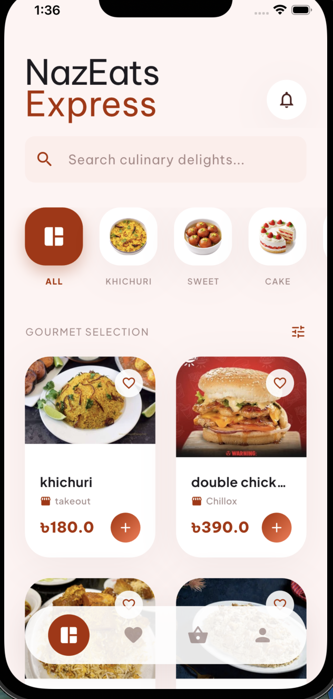 | 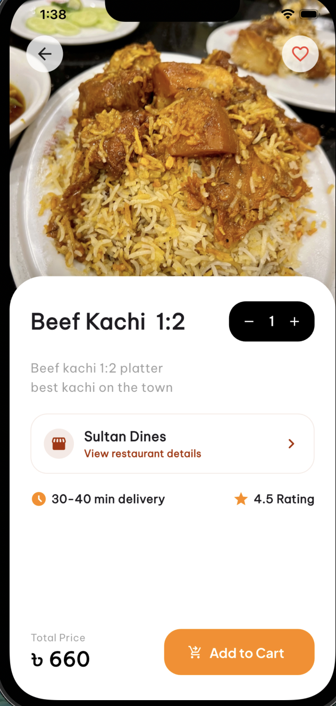 | 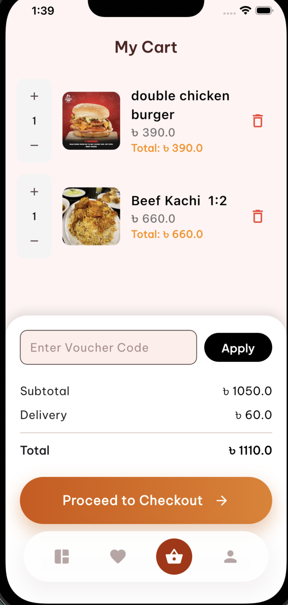 | 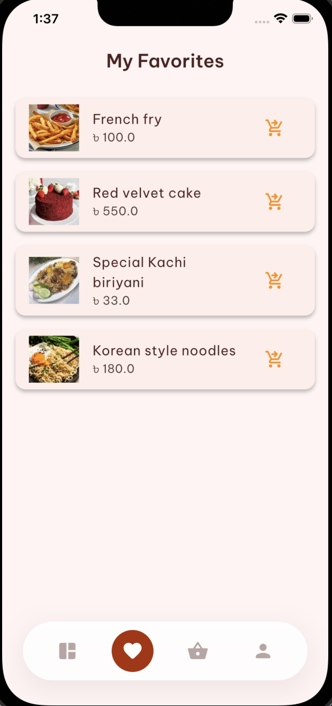 |

### 👨🍳 Owner & 🚴 Rider Experience
| Owner Dashboard | Owner Menu | Rider Dashboard | Rider Orders |
|:---:|:---:|:---:|:---:|
| 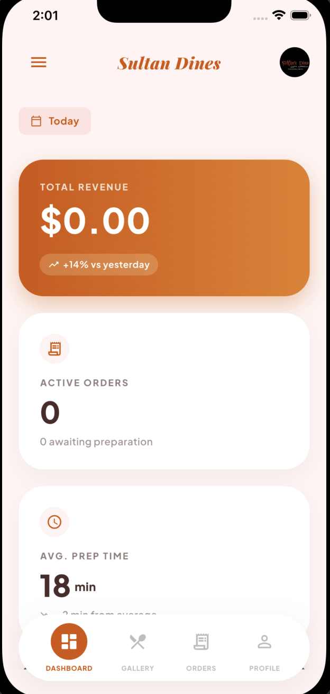 | 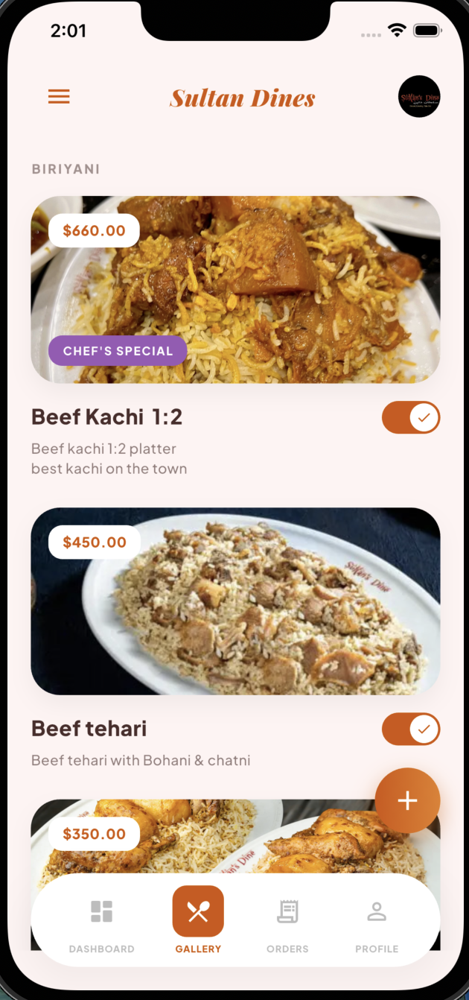 | 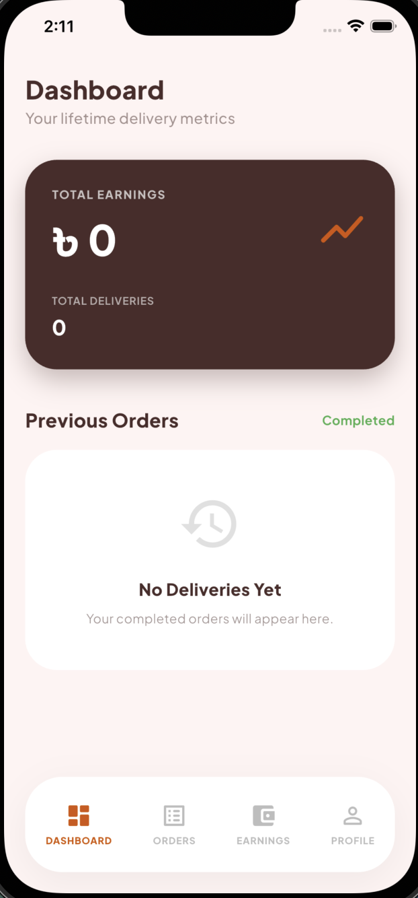 | 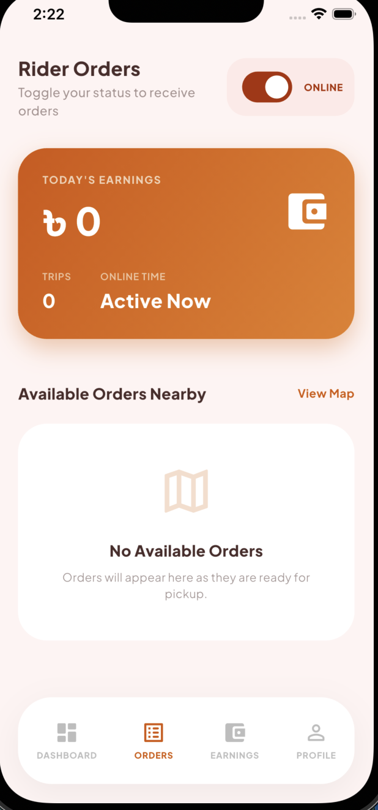 |

### 🛡️ Administrative Control
| Admin Dashboard | Order List | Provider Approval | Admin Login |
|:---:|:---:|:---:|:---:|
| 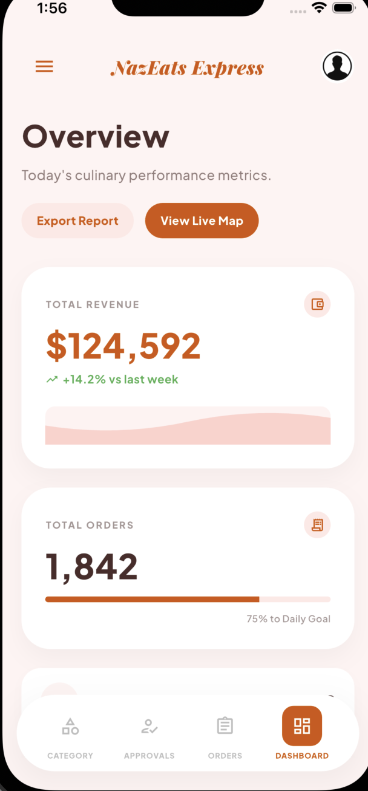 | 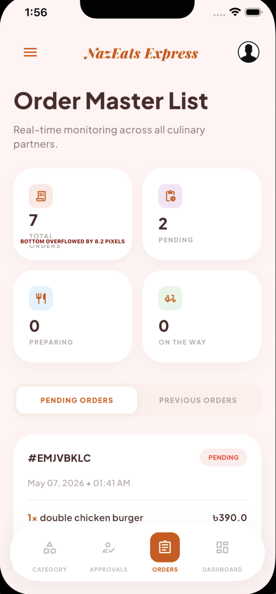 | 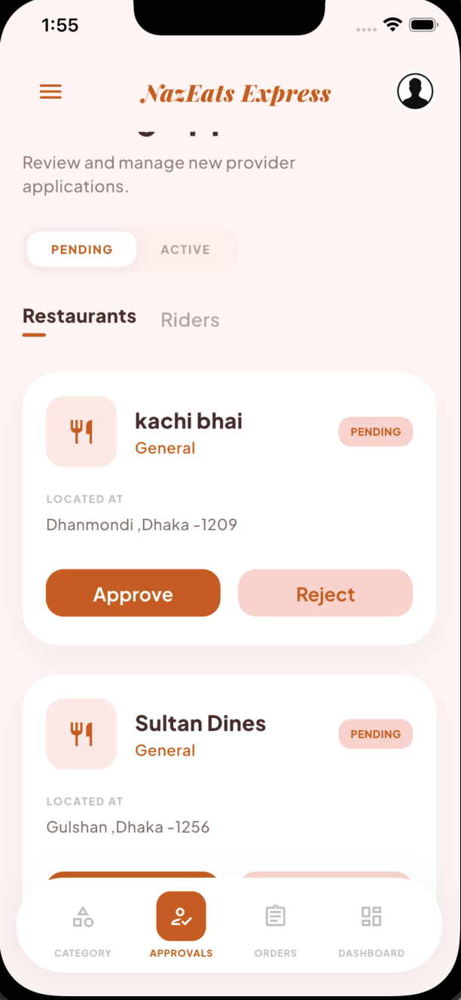 | 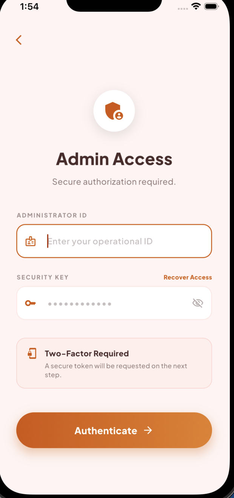 |

---

## ⚙️ Setup & Installation

1.  **Clone the Repository**
    ```bash
    git clone https://github.com/NazmulBhuiyanBD/food_delivery_app.git
    cd food_delivery_app
    ```

2.  **Initialize Firebase**
    *   Create a new project on [Firebase Console](https://console.firebase.google.com/).
    *   Add Android/iOS apps and download `google-services.json` / `GoogleService-Info.plist`.
    *   Enable **Firestore**, **Authentication**, and **Storage**.

3.  **Environment Configuration**
    *   Configure your Cloudinary credentials in the relevant service files.
    *   Ensure SSLCommerz credentials are set for payment testing.

4.  **Install Dependencies & Run**
    ```bash
    flutter pub get
    flutter run
    ```

---

## 📝 License

Distributed under the MIT License. See `LICENSE` for more information.

---
**Developed with ❤️ by [Nazmul Bhuiyan](https://github.com/NazmulBhuiyanBD)**
